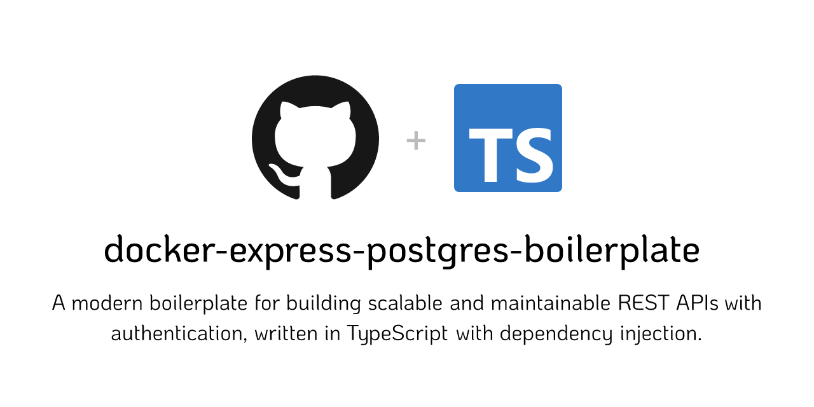

<p align="center">
  
</p>
<h1 align="center">Docker Express Postgres Boilerplate</h1>

<p align="center">
  <a href="https://github.com/alexleboucher/docker-express-postgres-boilerplate/actions/workflows/main-build.yml">
    
  </a>
  <a href="https://codecov.io/gh/alexleboucher/docker-express-postgres-boilerplate" >
    
  </a>
  <a href="https://snyk.io/test/github/alexleboucher/docker-express-postgres-boilerplate">
    
  </a>
  <a href="https://stackshare.io/alexleboucher/docker-express-postgres-boilerplate">
    
  </a>
</p>

<p align="center">
  <b>A modern boilerplate for building scalable and maintainable REST APIs with authentication, written in TypeScript. It features Docker, Express, TypeORM, jsonwebtoken for authentication by JWT, and integrates Clean Architecture principles with Dependency Injection powered by Inversify.</b></br>
  <sub>Made with ❤️ by <a href="https://github.com/alexleboucher">Alex Le Boucher</a> and <a href="https://github.com/alexleboucher/docker-express-postgres-boilerplate/graphs/contributors">contributors</a></sub>
</p>

<br />

---

## Overview

The main goal of this boilerplate is to provide a robust foundation for building a scalable and maintainable REST API with Express, following modern development practices.

It integrates common features such as:

- Docker containerization
- Database connection (PostgreSQL with TypeORM)
- Authentication (using jsonwebtoken)
- Centralized error handling
- Clean Architecture principles for better separation of concerns
- Dependency Injection powered by Inversify for modular and testable code

Some basic routes for authentication and user creation are already implemented, allowing you to quickly start your project. The architecture is designed to be extensible, making it easy to add new features or adapt it to your needs.
For more details on the already implemented routes, see [API Routes](#api-routes).

End-to-end and unit tests are already implemented, ensuring a robust testing strategy. The code coverage is over 90%, providing high confidence in the stability and reliability of the boilerplate.

Packages are frequently upgraded. You can easily see the packages version status [here](https://docs.google.com/spreadsheets/d/1vIeh02Y_SNqVuoQYIxjEXZTnDHQHr5ctQAk2EgS84KQ/edit?usp=share_link).

⭐ If you like it, please leave a star, it helps me a lot! ⭐

---

## Features

- **Docker containerization** to easily run your code anywhere and avoid installing tools like PostgreSQL on your computer.
- **Authentication by JWT** with [jsonwebtoken](https://github.com/auth0/node-jsonwebtoken).
- **Simplified Database Query** managed by [TypeORM](https://github.com/typeorm/typeorm).
- **Object-oriented database model** with [TypeORM](https://github.com/typeorm/typeorm) entities.
- **Integrated Testing Tools** with [Jest](https://jestjs.io/fr/docs/getting-started).
  - **Unit tests** and **end-to-end (E2E) tests** implemented using [Supertest](https://github.com/ladjs/supertest).
  - **Tests utilities** to simplify the creation of new tests.
  - **High code coverage** (>90%) to ensure reliability and stability.
- **Clean Architecture** principles for better separation of concerns and scalability.
- **Dependency Injection** powered by [Inversify](https://github.com/inversify/InversifyJS), ensuring a modular and testable code structure.
- **Controller management** with [inversify-express-utils](https://github.com/inversify/inversify-express-utils) for clean and structured route definitions.
- **Route protection** with custom middleware.
- **Error handling** with centralized and consistent middleware.
- **Basic Security Features** with [Helmet](https://helmetjs.github.io/) and [cors](https://github.com/expressjs/cors).
- **Schema validation** thanks to [Zod](https://github.com/colinhacks/zod).
- **Transactions control** with [TypeORM](https://github.com/typeorm/typeorm).
- **Configurated Code Linter** with [ESLint](https://eslint.org/) and common rules.
- **HTTP Request logging** with [morgan](https://github.com/expressjs/morgan).
- **Migration generation** based on entity changes thanks to [TypeORM](https://github.com/typeorm/typeorm).

---

## Table of Contents

- [Getting Started](#getting-started)
- [Scripts](#scripts)
- [API Routes](#api-routes)
- [Project Structure](#project-structure)
- [Environment Variables](#environment-variables)
- [Authentication](#authentication)
- [Migrations](#migrations)
- [Tests](#tests)
- [HTTP Request Logging](#http-request-logging)
- [Common Errors](#common-errors)
- [Clean Github Templates and Workflows](#clean-github-templates-and-workflows)
- [Upcoming Features](#upcoming-features)
- [Further Documentations](#further-documentations)
- [Contributing](#contributing)
- [License](#license)

---

## Getting Started

### Step 1: Clone the project

```bash
git clone https://github.com/alexleboucher/docker-express-postgres-boilerplate
cd docker-express-postgres-boilerplate
rm -rf .git # Windows: rd /s /q .git
yarn install
```

**Note:**
`rm -rf .git` (or `rd /s /q .git` on Windows) deletes the git info of the branch like history.

### Step 2: Copy `.env.example` file

**macOS/Linux:**
```bash
cp .env.example .env
```
**Windows:**
```bash
copy .env.example .env
```

### Step 3: Start the server

Start the application in a Docker container and run the development server:

```bash
yarn docker:up
yarn dev
```

> This starts a local server using `nodemon`, which automatically restarts the server when file changes are detected.
> The server will run on `http://localhost:8000`.

### Step 4: Test the server

To verify the server is running:
1. Open your browser and navigate to `http://localhost:8000/health`.
2. Alternatively, use a tool like [Postman](https://www.postman.com/) to query the endpoint.

You should see the response:
```json
{ "success": true }
```

### Step 5: Create the user database table

Create the necessary database tables by running the migrations:

```bash
yarn migration:run
```

### Step 6 (optional): Clean Github templates and workflows

The project contains Github templates and workflows. If you don't want to keep them, you can easily delete them by following this [section](#clean-github-templates-and-workflows).

---

## Scripts

⚠️ Except Docker scripts, all the scripts must be executed inside the `backend` container shell.


### Docker

- Run `yarn docker:up` to start the containers defined in `docker-compose.yml`. It automatically opens a shell in the `backend` container. Inside this shell, you can execute other scripts like `yarn dev`.
- Run `yarn docker:test:up` to start the containers in test mode.
- Run `yarn docker:down` to stop all running containers.
- Run `yarn docker:shell` to open a shell inside the `backend` container.
- Run `yarn docker:build` to build a Docker image of your API.

### Install

- Install all dependencies with `yarn install`.

### Running in dev mode

- Run `yarn dev` to start the application in development mode using [nodemon](https://www.npmjs.com/package/nodemon). It automatically reloads the server when file changes are detected. By default, the server will run on `http://localhost:8000`.

### Build

- Run `yarn build` to compile the project. The output files will be placed in the `build/` directory.
- Run `yarn start` to start the compiled project.
- Run `yarn type-check` to perform type checking.

### Migrations

- Run `yarn migration:run` to execute all pending migrations.
- Run `yarn migration:generate MigrationName` to generate a migration based on the current entity changes.
- Run `yarn migration:create MigrationName` to create an empty migration file.
- Run `yarn migration:revert` to undo the last executed migration. To revert multiple migrations, execute the command multiple times.

### Linting

- Run `yarn lint` to analyze code quality using ESLint. This displays warnings and errors.
- Run `yarn lint:fix` to automatically fix linting issues where possible.

### Test

- Run `yarn test` to execute the unit and integration tests.
- Run `yarn test:coverage` to execute tests and generate a coverage report.

---

## API Routes

| Method | Route | Description | Body |
|--------|-------|-------------| ---- |
| GET    | `/health` | Retures the server health status | None. |
| POST   | `/users` | Creates a new user. | `username` (min. 5 chars), `email` (valid), `password` (min. 8 chars). |
| POST   | `/auth/login` | Logs in a user. | `email` and `password`. |
| GET    | `/auth/authenticated` | Returns the user authentication status | None. |

---

## Project Structure

| Name                                          | Description                                   |
| --------------------------------------------- | --------------------------------------------- |
| **@types/**                                   | Global types definitions |
| **build/**                                    | Compiled source files will be placed here |
| **coverage/**                                 | Jest coverage results will be placed here |
| **src/**                                      | Source files |
| **src/app/**                                  | Application layer containing controllers, middlewares, and request handlers. |
| **src/app/controllers/**                      | REST API controllers implemented with `inversify-express-utils`. |
| **src/app/middlewares/**                      | Custom Express middlewares for authentication, error handling, etc. |
| **src/app/request-handlers/**                 | Handlers for processing API requests following the Clean Architecture principles. Organized into commands and queries. |
| **src/app/server.ts**                         | Express server configuration and initialization. |
| **src/container/**                            | Dependency Injection container setup with `InversifyJS`. |
| **src/core/**                                 | Core utilities, interfaces, and helpers used across the project. |
| **src/domain/**                               | Domain layer containing business logic, models, and interfaces. |
| **src/domain/models/**                        | Domain models representing business entities. |
| **src/domain/repositories/**                  | Interfaces for database operations. |
| **src/domain/services/**                      | Interfaces for domain-level services (e.g., authentication, encryption). |
| **src/domain/use-cases/**                     | Use cases implementing business logic. |
| **src/infra/**                                | Infrastructure layer providing implementations for core and domain abstractions. |
| **src/infra/auth/**                           | Authentication implementations |
| **src/infra/database/**                       | Database configuration, models, and migrations. |
| **src/infra/database/repositories/**          | Concrete implementations of domain repository interfaces using TypeORM. |
| **src/infra/id-generator/**                   | UUID-based ID generator. |
| **src/infra/security/**                       | Security utilities like password encryption. |
| **src/infra/logger/**                         | Logger implementations. |
| **src/tests/**                                | Test suite, including unit and end-to-end tests. |
| **src/tests/e2e/**                            | End-to-end tests for API routes. |
| **src/tests/units/**                          | Unit tests for individual modules and layers. |
| **src/tests/helpers/**                        | Utilities for simplifying test setup and assertions. |

---

## Environment Variables

| Name                       | Description | Optional | Default value |
| -------------------------- | ------------| -------- | --------------|
| NODE_ENV                   | Specifies the environment (e.g., production, development, test). | ❌ | |
| HOST                       | Server host. | ✔️ | 0.0.0.0 |
| PORT                       | Server host port. | ✔️ | 8080 |
| DB_USER                    | Database username. | ❌ | |
| DB_HOST                    | Database host. | ❌ | |
| DB_NAME                    | Database name. | ❌ | |
| DB_PASSWORD                | Database password. | ❌ | |
| DB_PORT                    | Database host port. | ❌ | |
| DB_HOST_PORT               | Database mapped port for accessing the database in Docker. | ❌ | |
| TEST_DB_HOST               | Test database host. | ❌ | |
| TEST_DB_NAME               | Test database name. | ❌ | |
| TEST_DB_PORT               | Test database host port. | ❌ | |
| TEST_DB_HOST_PORT          | Test database mapped port for accessing the test database in Docker. | ❌ | |
| JWT_SECRET                 | Secret used to encryot JSON web tokens. | ❌ | |
| JWT_EXPIRES_IN_SECONDS     | Number of seconds before JWT tokens expire. | ✔️ | 86400 |
| CORS_ORIGIN_ALLOWED        | List of allowed origins for CORS. | ✔️ | * |
| DB_LOGGING                 | Enables or disables query logging in TypeORM. | ✔️ | false |
| TYPEORM_ENTITIES           | Path to TypeORM entity files. | ✔️ | src/infra/database/models/**/*.entity.ts |
| TYPEORM_MIGRATIONS         | Path to TypeORM migration files. | ✔️ | src/infra/database/migrations/**/*.ts |
| LOGGER_TYPE                | Specifies the type of logger to use | ✔️ | console |

---

## Authentication

This boilerplate uses JSON Web Tokens to handle authentication with `jsonwebtoken`. 

### Route Protection

To ensure route security and verify the user's authentication status, this boilerplate provides a custom middleware:  
**`AuthenticatedMiddleware`**, located in `src/app/middlewares/authenticated-middleware.ts`.

This middleware ensures the user is authenticated before allowing access to the route. It integrates seamlessly with the controllers, as shown in the example below:  

```typescript
@httpPost('/your-protected-route', MIDDLEWARES_DI_TYPES.AuthenticatedMiddleware)
public yourProtectedRoute(): void {
  // yourProtectedRoute logic here
}
```

This pattern allows you to secure endpoints declaratively and keeps the authentication logic consistent throughout the project.

---

## Migrations

This boilerplate uses **TypeORM** to handle database migrations efficiently. Migrations allow you to track and apply changes to your database schema in a controlled and versioned manner.  

All executed migrations are recorded in a dedicated database table, which enables TypeORM to:  
- Identify pending migrations that need to be executed.  
- Revert specific migrations if necessary.  

⚠️ **Important**: All migration commands must be executed from within the `backend` container shell.

### Creating a migration

To create a new migration, run the following command:  
```bash
yarn migration:create MigrationName
```

This will create an empty migration file in src/infra/database/migrations/. A migration file contains two functions:

- `up`: Defines the changes to be applied to the database when the migration is executed.
- `down`: Defines how to revert the changes applied by the `up` function.

You must manually define the logic for both functions when creating an empty migration.

### Generating a migration
TypeORM also allows you to generate migrations automatically based on changes in your entities. To generate a migration:
```bash
yarn migration:generate MigrationName
```

This will create a migration file in `src/infra/database/migrations/`. The content of the migration will be automatically generated by comparing your updated entities with the current database schema.

**Exemple:**
1. Add a new property `firstName` to the `User` entity:
```typescript
@Column({ nullable: false, length: 20 })
firstName!: string;
```
2. Run:
```bash
yarn migration:generate AddFirstNameInUser
```
3. A migration will be generated to add the `firstName` column to the `users` table.

### Running migrations

To execute pending migrations and update your database schema:
```bash
yarn migration:run
```
This will run all migrations that have not yet been applied to the database.

### Reverting migrations

To revert the last executed migration, run:
```bash
yarn migration:revert
```
If you need to revert multiple migrations, you can execute this command multiple times. Each execution will revert one migration in reverse order of their execution.

---

## Tests

Tests are located in `src/tests`.

In this boilerplate, [Jest](https://jestjs.io/docs/getting-started) is used to execute the tests.

The tests are divided into two types: **end-to-end tests** and **unit tests**.

### Running Tests

- **Run all tests:**
```bash
yarn test
```
Execute this command in the `backend` container shell after running command `yarn docker:test:up`

- **Run tests with coverage:**
```bash
yarn test:coverage
```

- **Run a specific test file:** Add the name or path of the file after the command. For example:
```bash
yarn test auth
```

### End-to-End Tests

#### Overview
End-to-end (E2E) tests validate the application’s behavior in product-like scenarios. They simulate user workflows and interactions with the API to ensure that the entire system functions as expected.

[E2E tests](https://github.com/ladjs/supertest) are implemented using `supertest` and located in `src/tests/e2e/`.

This project prioritizes **unit testing** over E2E testing. E2E tests primarily cover happy paths and critical features.

#### Creating End-to-End Tests

1. **Setup Test Environment:**
Create the test environment before executing your tests:
    ```typescript
    let testEnv: TestEnvironment;

    beforeAll(async () => {
      testEnv = await createTestEnvironment();
    });

    afterAll(async () => {
      await testEnv.close();
    });
    ```

2. **Clear Database (if needed):**
If the test requires a clean database state, clear the database before each test:
    ```typescript
    beforeEach(async () => {
      await testEnv.clearDatabase();
    });
    ```

    If your test does not require database connection (e.g., `/health` or `404` routes), you can disable it:
    ```typescript
    testEnv = await createTestEnvironment({ connectDatabase: false });
    ```

3. **Write Tests:**
Use `test` to define individual tests within `describe` blocks:
    ```typescript
    test('returns a 200 status for /health', async () => {
      const res = await testEnv.request().get('/health');

      expect(res.statusCode).toEqual(200);
    });
    ```

4. **Authenticated Requests:**
For tests requiring user authentication, create an authenticated request:
    ```typescript
    const request = await testEnv.authenticatedRequest();
    const res = await request.get('/auth/authenticated');

    expect(res.body).toEqual({ authenticated: true });
    ```

### Unit Tests

#### Overview
Unit tests focus on testing individual components or functions in isolation. They ensure the correctness of the smallest parts of your application, such as use cases, services, or utility functions.

Unit tests are located in `src/tests/unit/`.

#### Creating Unit Tests

1. **Mock Dependencies:**
Use libraries like [`jest-mock-extended`](https://github.com/marchaos/jest-mock-extended) to create mocks:
    ```typescript
    import { mock } from 'jest-mock-extended';

    const userRepository = mock<IUserRepository>();
    userRepository.existsByEmail.mockResolvedValue(false);
    ```

2. **Write Tests:**
Create descriptive test cases within `describe` blocks:
    ```typescript
    describe('CreateUserUseCase', () => {
      test('creates a user successfully', async () => {
        // Setup mocks and inputs
        const userRepository = mock<IUserRepository>();
        userRepository.create.mockResolvedValue(mockedUser);

        const useCase = new CreateUserUseCase(userRepository);
        const result = await useCase.execute(payload);

        expect(result).toBeInstanceOf(Success);
      });
    });
    ```

3. **Test Failure Scenarios:**
Include tests for error cases or edge conditions:
    ```typescript
    test('fails if email already exists', async () => {
      userRepository.existsByEmail.mockResolvedValue(true);

      const result = await useCase.execute(payload);

      expect(result).toBeInstanceOf(Failure);
    });
    ```

---

## HTTP Request Logging

To log HTTP requests, we use the express middleware [morgan](https://github.com/expressjs/morgan).
You can easily configure it by passing a [predifined format](https://github.com/expressjs/morgan#predefined-formats) as parameter in `src/config/express.ts`.

Example:
```typescript
app.use(morgan('short'));
```

---

## Common Errors

If you encounter an error when running `yarn docker:up`, make sure Docker Desktop is running.

If you encounter an error when running a script, make sure you ran the script in the `backend` container shell.

---

## Clean Github Templates and Workflows

### Templates

If you don't want to keep the issue templates, you can delete the folder `ISSUE_TEMPLATE` in `.github` folder. 

If you don't want to keep the Pull Request template, you can delete the file `pull_request_template.md` in `.github` folder. 

### Workflows

There are 3 workflows:
1. The workflow `pull-request` concerns the pull requests. It checks linting, build, runs tests and sends the coverage to [Codecov](https://about.codecov.io/). If you don't want to keep it, you can delete the file `pull-request.yml` in the folder `workflows` in `.github`.

2. The workflow `main-tests` is triggered when code is merged or pushed on main. It runs the tests and sends the coverage to [Codecov](https://about.codecov.io/). It has coverage for the main branch. If you don't want to keep it, you can delete the file `main-tests.yml` in the folder `workflows`.

If you want to keep the tests on pull request but don't want to use Codecov, you can delete `main-tests` and only delete the last step `Upload coverage to Codecov` in `pull-request.yml`.<br>
But if you want to use CodeCov, the only thing you need to do is set your `CODECOV_TOKEN` in your github secrets.

3. The workflow `main-build` is triggered when something is merged or pulled on main. It builds the project and its primary goal is to check if main is building. If you don't want to keep it, you can delete the file `main-build.yml` in the folder `workflows`.

### Github files

This repository contains `CONTRIBUTING`, `CODE_OF_CONDUCT` and `LICENSE` files, you can delete them too.

---

## Upcoming Features

You can see the upcoming or in progress features [here](https://github.com/users/alexleboucher/projects/1/views/1).

---

## Further Documentations

| Name & Link                       | Description                       |
| --------------------------------- | --------------------------------- |
| [Express](https://expressjs.com/) | Express is a minimal and flexible Node.js web application framework that provides a robust set of features for web and mobile applications. |
| [TypeORM](http://typeorm.io/#/) | TypeORM is highly influenced by other ORMs, such as Hibernate, Doctrine and Entity Framework. |
| [jsonwebtoken](https://github.com/auth0/node-jsonwebtoken) | An implementation of JSON Web Tokens for Node.js that helps you securely transmit information between parties as a JSON object. |
| [Docker](https://www.docker.com/) | Docker is a platform designed to help developers build, share, and run modern applications. We handle the tedious setup, so you can focus on the code. |
| [PostgreSQL](https://www.postgresql.org/) | PostgreSQL is a powerful, open source object-relational database system with over 35 years of active development that has earned it a strong reputation for reliability, feature robustness, and performance. |
| [TypeScript](https://www.typescriptlang.org/) | TypeScript is a strongly typed programming language that builds on JavaScript, giving you better tooling at any scale. |
| [Inversify](https://inversify.io/) | Inversify is a lightweight and flexible inversion of control (IoC) container. It helps in managing dependencies and achieving loose coupling in applications. |
| [Jest](https://jestjs.io/fr/docs/getting-started/) | Jest is a Testing Framework with a focus on simplicity. |
| [supertest](https://github.com/ladjs/supertest/) | A library that allows developers and testers to test the APIs. |
| [Helmet](https://helmetjs.github.io/) | Helmet helps you secure your Express apps by setting various HTTP headers. |
| [cors](https://github.com/expressjs/cors) | CORS is a node.js package for providing a Connect/Express middleware that can be used to enable CORS with various options. |
| [ESLint](https://eslint.org/docs/latest/use/getting-started) | ESLint is a tool for identifying and reporting on patterns found in code, with the goal of making code more consistent and avoiding bugs. |

---

## Contributing

Anyone and everyone is welcome to [contribute](CONTRIBUTING.md).

If you want to propose new features, fix a bug or improve the README, don't hesitate to open a pull request. If your changes concern new feature or bugfix, please open an issue before.

However, if you decide to get involved, please take a moment to review the
[guidelines](CONTRIBUTING.md).

---

## License

[MIT](/LICENSE)
